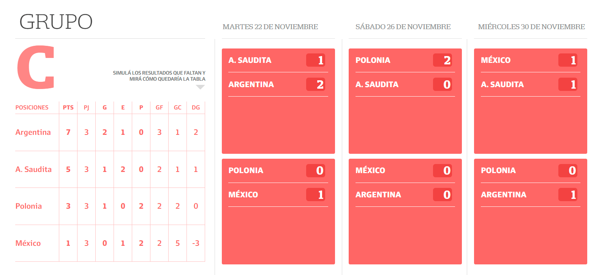
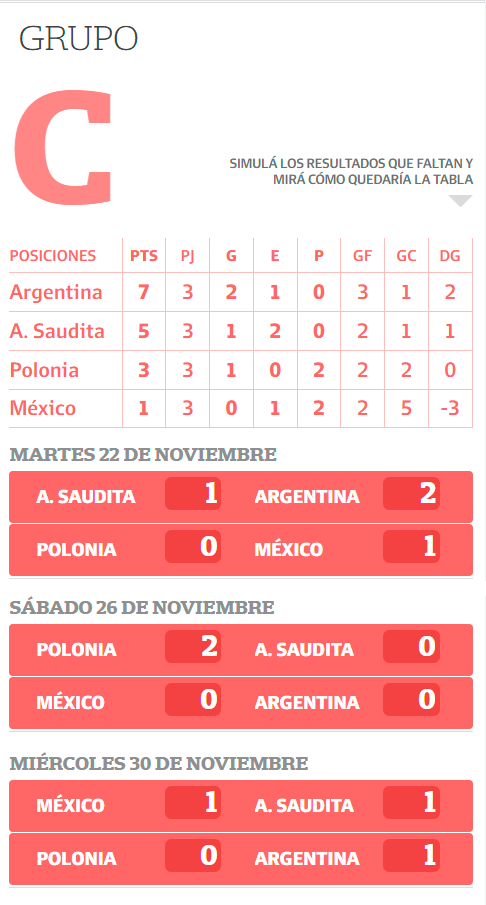

# Calculadora Mundial de Fútbol Qatar 2022

**Objetivo:** desarrollar una calculadora que, según el pronóstico de los usuarios, ordene la tabla de posiciones del GRUPO C del mundial de Qatar 2022, en la instancia FASE DE GRUPOS.

**Funcionamiento:**
El usuario deberá pronosticar como saldrán los partidos completando los campos de resultado de cada caso (ver capturas) y al hacerlo, reactivamente se deberán actualizar los datos de la tabla y las posiciones de cada país, siguiendo el siguiente reglamento:

- Un partido ganado supone **3 puntos** para el equipo ganador, un empate supone **1 punto** para cada equipo y una derrota, **0 puntos.**

- Para ordenar la posición de cada equipo en la tabla se deben seguir los siguientes criterios, en orden de prioridad:

  **1ro.** Se ordenarán de mayor a menor los equipos con mayor número de puntos obtenidos en todos los partidos de grupo (PTS);  
   **2do.** Si dos o más equipos obtienen la misma cantidad de puntos la tabla se ordená en función de la mayor diferencia de goles en todos los partidos de grupo (DG);  
   **3ro**. Si dos o más equipos aun obtienen el mismo resultado, la tabla se ordenará de mayor a menor de acuerdo a la cantidad de goles a favor marcados por cada equipo en todos los partidos de grupo (GF);  
  **4to**. Si dos o más equipos obtienen el mismo resultado conforme a los tres criterios antes mencionados, sus lugares se determinarán de acuerdo al equipo vencedor del partido jugado entre los equipos en cuestión (si es que ya han jugado entre sí);

## Datos

Para armar la tabla y los partidos a pronosticar correspondientes al grupo C, se deberá consumir los datos de los siguientes 2 jsons:

1. JSON partidos: https://especialess3.lanacion.com.ar/22/03/mundial2022-fixture/data/fechas.json  
   De este json se obtienen los datos de los partidos que se disputan (KEY EQUIPO A, EQUIPO B) en la FASE DE GRUPOS (KEY INSTANCIA) en una determinada fecha (KEY FECHA)

2. Diccionario de equipos: https://especialess3.lanacion.com.ar/22/03/mundial2022-fixture/data/diccEquipos.json
   De esta diccionario se obtienen los datos de los equipos.

## MockUp

REFERENCIAS

PTS: PUNTOS TOTALES 
PJ: PARTIDOS JUGADOS 
G: PARTIDOS GANADOS 
E: PARTIDOS EMPATADOS 
P: PARTIDOS PERDIDOS 
GF: GOLES A FAVOR 
GC: GOLES EN CONTRA 
DG: DIFERENCIA DE GOL (GF - GC)

### Vista desktop

### Vista mobile

## Fonts LN

https://especialess3.lanacion.com.ar/fonts/fontsWithPrumo.css  
Variables utilizadas: **suecananobold, suecananomedium** para las fuenrtes san serif y **suecaslab** para las serif

## Uso de librerías
Para 

## SUBIR EL PROYECTO A GITHUB PAGES
